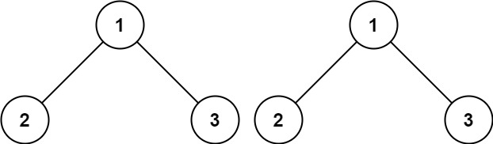

<h1 style="text-align: center;"> <span style="color: #00AF9B;">100. 相同的树</span> </h1>

### 🚀 LeetCode

<base target="_blank">

<span style="color: #00AF9B;">**Easy**</span> [**https://leetcode.cn/problems/same-tree/**](https://leetcode.cn/problems/same-tree/)

---

### ❓ Description

<br/>

给你两棵二叉树的根节点 `p` 和 `q` ，编写一个函数来检验这两棵树是否相同。

如果两个树在结构上相同，并且节点具有相同的值，则认为它们是相同的。

<br/>

**示例 1：**



```
输入: p = [1, 2, 3], q = [1, 2, 3]
输出: true
```

**示例 2：**


```
输入: p = [1, 2], q = [1, null, 2]
输出: false
```

**示例 3：**


```
输入: p = [1, 2, 1], q = [1, 1, 2]
输出: false
```

<br/>

**提示：**

* 两棵树上的节点数目都在范围 `[0, 100]` 内
* -10<sup>4</sup> <= `Node.val` <= 10<sup>4</sup>

---

### ❗ Solution

<br/>

#### 思路

* `p` 和 `q` 代表两棵树 **相同位置上的两个节点**

<br/>

* `p` 和 `q` 都为 `null` 时，两个节点相同，返回 `true`
* 排除都为 `null` 的情况后，如果 `p` 或 `q` 仍然有一个为 `null`
* 说明两个节点，一个为 `null`，一个不为 `null`，返回 `false`

<br/>

* 两个节点都不为 `null` 时，判断两个节点的值是否相等
* 如果值不相等，返回 `false`

<br/>

* 两个节点都不为 `null`，且值相等
* 递归调用，分别对 **左右子树上的节点** 进行判断
* 当 **左右子树** 是否相同的判断都返回 `true` 时，**当前节点** 也返回 `true`

<br/>

#### C

```
/**
 * Definition for a binary tree node.
 * struct TreeNode {
 *     int val;
 *     struct TreeNode *left;
 *     struct TreeNode *right;
 * };
 */
bool isSameTree(struct TreeNode* p, struct TreeNode* q) {
    if (p == NULL && q == NULL) {
        return true;
    }
    if (p == NULL || q == NULL) {
        return false;
    }
    if (p->val != q->val) {
        return false;
    } else {
        return isSameTree(p->left, q->left) && 
               isSameTree(p->right, q->right);
    }
}
```

<br/>

#### C++

```
/**
 * Definition for a binary tree node.
 * struct TreeNode {
 *     int val;
 *     TreeNode *left;
 *     TreeNode *right;
 *     TreeNode() : val(0), left(nullptr), right(nullptr) {}
 *     TreeNode(int x) : val(x), left(nullptr), right(nullptr) {}
 *     TreeNode(int x, TreeNode *left, TreeNode *right) : val(x), left(left), right(right) {}
 * };
 */
class Solution {
public:
    bool isSameTree(TreeNode* p, TreeNode* q) {
        if (p == NULL && q == NULL) {
            return true;
        }
        if (p == NULL || q == NULL) {
            return false;
        }
        if (p->val != q->val) {
            return false;
        } else {
            return isSameTree(p->left, q->left) && 
                   isSameTree(p->right, q->right);
        }
    }
};
```

<br/>

#### Ruby

```
# Definition for a binary tree node.
# class TreeNode
#     attr_accessor :val, :left, :right
#     def initialize(val = 0, left = nil, right = nil)
#         @val = val
#         @left = left
#         @right = right
#     end
# end
# @param {TreeNode} p
# @param {TreeNode} q
# @return {Boolean}
def is_same_tree(p, q)
    if (p == nil && q == nil)
        return true
    end
    if (p == nil || q == nil)
        return false
    end
    if (p.val != q.val) 
        return false
    else
        return is_same_tree(p.left, q.left) && 
               is_same_tree(p.right, q.right)
    end
end
```

<br/>

#### Java

```
/**
 * Definition for a binary tree node.
 * public class TreeNode {
 *     int val;
 *     TreeNode left;
 *     TreeNode right;
 *     TreeNode() {}
 *     TreeNode(int val) { this.val = val; }
 *     TreeNode(int val, TreeNode left, TreeNode right) {
 *         this.val = val;
 *         this.left = left;
 *         this.right = right;
 *     }
 * }
 */
class Solution {
    public boolean isSameTree(TreeNode p, TreeNode q) {
        if (p == null && q == null) {
            return true;
        }
        if (p == null || q == null) {
            return false;
        }
        if (p.val != q.val) {
            return false;
        } else {
            return isSameTree(p.left, q.left) && 
                   isSameTree(p.right, q.right);
        }
    }
}
```

<br/>

#### JavaScript

```
/**
 * Definition for a binary tree node.
 * function TreeNode(val, left, right) {
 *     this.val = (val===undefined ? 0 : val)
 *     this.left = (left===undefined ? null : left)
 *     this.right = (right===undefined ? null : right)
 * }
 */
/**
 * @param {TreeNode} p
 * @param {TreeNode} q
 * @return {boolean}
 */
var isSameTree = function(p, q) {
    if (p == null && q == null) {
        return true
    }
    if (p == null || q == null) {
        return false
    }
    if (p.val != q.val) {
        return false
    } else {
        return isSameTree(p.left, q.left) && 
               isSameTree(p.right, q.right)
    }
};
```

<br/>

#### PHP

```
/**
 * Definition for a binary tree node.
 * class TreeNode {
 *     public $val = null;
 *     public $left = null;
 *     public $right = null;
 *     function __construct($val = 0, $left = null, $right = null) {
 *         $this->val = $val;
 *         $this->left = $left;
 *         $this->right = $right;
 *     }
 * }
 */
class Solution {
    /**
     * @param TreeNode $p
     * @param TreeNode $q
     * @return Boolean
     */
    function isSameTree($p, $q) {
        if ($p == null && $q == null) {
            return true;
        }
        if ($p == null || $q == null) {
            return false;
        }
        if ($p->val != $q->val) {
            return false;
        } else {
            return $this->isSameTree($p->left, $q->left) && 
                   $this->isSameTree($p->right, $q->right);
        }
    }
}
```

<br/>

#### C#

```
/**
 * Definition for a binary tree node.
 * public class TreeNode {
 *     public int val;
 *     public TreeNode left;
 *     public TreeNode right;
 *     public TreeNode(int val=0, TreeNode left=null, TreeNode right=null) {
 *         this.val = val;
 *         this.left = left;
 *         this.right = right;
 *     }
 * }
 */
public class Solution {
    public bool IsSameTree(TreeNode p, TreeNode q) {
        if (p == null && q == null) {
            return true;
        }
        if (p == null || q == null) {
            return false;
        }
        if (p.val != q.val) {
            return false;
        } else {
            return IsSameTree(p.left, q.left) && 
                   IsSameTree(p.right, q.right);
        }
    }
}
```

<br/>

#### Scala

```
/**
 * Definition for a binary tree node.
 * class TreeNode(_value: Int = 0, _left: TreeNode = null, _right: TreeNode = null) {
 *   var value: Int = _value
 *   var left: TreeNode = _left
 *   var right: TreeNode = _right
 * }
 */
object Solution {
    def isSameTree(p: TreeNode, q: TreeNode): Boolean = {
        if (p == null && q == null) {
            return true;
        }
        if (p == null || q == null) {
            return false;
        }
        if (p.value != q.value) {
            return false;
        }
        isSameTree(p.left, q.left) && isSameTree(p.right, q.right);
    }
}
```

<br/>

#### Go

```
/**
 * Definition for a binary tree node.
 * type TreeNode struct {
 *     Val int
 *     Left *TreeNode
 *     Right *TreeNode
 * }
 */
func isSameTree(p *TreeNode, q *TreeNode) bool {
    if p == nil && q == nil {
        return true;
    }
    if p == nil || q == nil {
        return false;
    }
    if p.Val != q.Val {
        return false;
    } else {
        return isSameTree(p.Left, q.Left) && 
               isSameTree(p.Right, q.Right);
    }
}
```

<br/>

#### Dart

```
/**
 * Definition for a binary tree node.
 * class TreeNode {
 *   int val;
 *   TreeNode? left;
 *   TreeNode? right;
 *   TreeNode([this.val = 0, this.left, this.right]);
 * }
 */
class Solution {
    bool isSameTree(TreeNode? p, TreeNode? q) {
        if (p == null && q == null) {
            return true;
        }
        if (p == null || q == null) {
            return false;
        }
        if (p.val != q.val) {
            return false;
        } else {
            return isSameTree(p.left, q.left) && 
                   isSameTree(p.right, q.right);
        }
    }
}
```

<br/>

#### TypeScript

```
/**
 * Definition for a binary tree node.
 * class TreeNode {
 *     val: number
 *     left: TreeNode | null
 *     right: TreeNode | null
 *     constructor(val?: number, left?: TreeNode | null, right?: TreeNode | null) {
 *         this.val = (val===undefined ? 0 : val)
 *         this.left = (left===undefined ? null : left)
 *         this.right = (right===undefined ? null : right)
 *     }
 * }
 */
function isSameTree(p: TreeNode | null, q: TreeNode | null): boolean {
    if (p == null && q == null) {
        return true
    }
    if (p == null || q == null) {
        return false
    }
    if (p.val != q.val) {
        return false
    } else {
        return isSameTree(p.left, q.left) && 
               isSameTree(p.right, q.right)
    }
};
```

<br/>

#### Swift

```
/**
 * Definition for a binary tree node.
 * public class TreeNode {
 *     public var val: Int
 *     public var left: TreeNode?
 *     public var right: TreeNode?
 *     public init() { self.val = 0; self.left = nil; self.right = nil; }
 *     public init(_ val: Int) { self.val = val; self.left = nil; self.right = nil; }
 *     public init(_ val: Int, _ left: TreeNode?, _ right: TreeNode?) {
 *         self.val = val
 *         self.left = left
 *         self.right = right
 *     }
 * }
 */
class Solution {
    func isSameTree(_ p: TreeNode?, _ q: TreeNode?) -> Bool {
        if (p == nil && q == nil) {
            return true;
        }
        if (p == nil || q == nil) {
            return false;
        }
        if (p?.val != q?.val) {
            return false;
        } else {
            return isSameTree(p?.left, q?.left) && 
                   isSameTree(p?.right, q?.right);
        }
    }
}
```

<br/>

#### Kotlin

```
/**
 * Example:
 * var ti = TreeNode(5)
 * var v = ti.`val`
 * Definition for a binary tree node.
 * class TreeNode(var `val`: Int) {
 *     var left: TreeNode? = null
 *     var right: TreeNode? = null
 * }
 */
class Solution {
    fun isSameTree(p: TreeNode?, q: TreeNode?): Boolean {
        if (p == null && q == null) {
            return true;
        }
        if (p == null || q == null) {
            return false;
        }
        if (p.`val` != q.`val`) {
            return false;
        } else {
            return isSameTree(p.left, q.left) && 
                   isSameTree(p.right, q.right);
        }
    }
}
```
