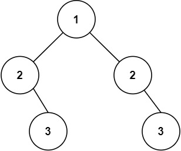

<h1 style="text-align: center;"> <span style="color: #00AF9B;">101. 对称二叉树</span> </h1>

### 🚀 LeetCode

<base target="_blank">

<span style="color: #00AF9B;">**Easy**</span> [**https://leetcode.cn/problems/symmetric-tree/**](https://leetcode.cn/problems/symmetric-tree/)

---

### ❓ 题目描述

<br/>

给你一个二叉树的根节点 `root` ， 检查它是否轴对称。

<br/>

**示例 1：**


```
输入: root = [1, 2, 2, 3, 4, 4, 3]
输出: true
```

**示例 2：**



```
输入: root = [1, 2, 2, null, 3, null, 3]
输出: false
```

<br/>

**提示：**

* 树中节点数目在范围 `[1, 1000]` 内
* `-100 <= Node.val <= 100`

<br/>

**进阶：** 你可以运用递归和迭代两种方法解决这个问题吗？

---

### ❗ 题解

<br/>

#### 思路

* 因为需要同时判断树的两端，需要传入两个节点
* 而题目给出的函数只能接收一个节点，无法直接在这个函数上进行递归
* 所以需要新建一个函数 `isSame()` 来进行递归
* 将 **根节点** 的 **左右子节点** 传入 `isSame()` 函数中进行递归

<br/>

* 如果 `node1` 和 `node2` 都为 `null`，说明 **当前两个节点对称**，返回 `true`

<br/>

* 如果有一个节点为 `null`，另一个节点不为 `null`，返回 `false`
    * 上面第一个 `if` 已经将 **当前两个节点** 都为 `null` 的情况处理了
    * 此时第二个 `if` 如果判断到一个节点为 `null`，另一个就肯定是不为 `null`
* 如果两个节点的值 `val` 不同，也返回 `false`

<br/>

* 如果当前传入的两个节点都不为 `null`，且节点的值 `val` 相同，进行递归判断
* 将 `node1` 的 **左节点** 和 `node2` 的 **右节点** 传入 `isSame()` 进行递归
* 将 `node1` 的 **右节点** 和 `node2` 的 **左节点** 传入 `isSame()` 进行递归
* 如果两个递归传回的结果都为 `true`，说明 **当前两个节点对称**

<br/>

#### C

```
/**
 * Definition for a binary tree node.
 * struct TreeNode {
 *     int val;
 *     struct TreeNode *left;
 *     struct TreeNode *right;
 * };
 */
bool isSame(struct TreeNode* node1, struct TreeNode* node2) {
    if (node1 == NULL && node2 == NULL) {
        return true;
    }
    if (node1 == NULL || node2 == NULL || node1->val != node2->val) {
        return false;
    }
    return isSame(node1->left, node2->right) && 
           isSame(node1->right, node2->left);
}

bool isSymmetric(struct TreeNode* root){
    return isSame(root->left, root->right);
}
```

<br/>

#### C++

```
/**
 * Definition for a binary tree node.
 * struct TreeNode {
 *     int val;
 *     TreeNode *left;
 *     TreeNode *right;
 *     TreeNode() : val(0), left(nullptr), right(nullptr) {}
 *     TreeNode(int x) : val(x), left(nullptr), right(nullptr) {}
 *     TreeNode(int x, TreeNode *left, TreeNode *right) : val(x), left(left), right(right) {}
 * };
 */
class Solution {
public:
    bool isSymmetric(TreeNode* root) {
        return isSame(root->left, root->right);
    }

    bool isSame(TreeNode* node1, TreeNode* node2) {
        if (node1 == NULL && node2 == NULL) {
            return true;
        }
        if (node1 == NULL || node2 == NULL || node1->val != node2->val) {
            return false;
        }
        return isSame(node1->left, node2->right) && 
               isSame(node1->right, node2->left);
    }
};
```

<br/>

#### Java

```
/**
 * Definition for a binary tree node.
 * public class TreeNode {
 *     int val;
 *     TreeNode left;
 *     TreeNode right;
 *     TreeNode() {}
 *     TreeNode(int val) { this.val = val; }
 *     TreeNode(int val, TreeNode left, TreeNode right) {
 *         this.val = val;
 *         this.left = left;
 *         this.right = right;
 *     }
 * }
 */
class Solution {
    public boolean isSymmetric(TreeNode root) {
        return isSame(root, root);
    }

    public boolean isSame(TreeNode node1, TreeNode node2) {
        if (node1 == null && node2 == null) {
            return true;
        }
        if (node1 == null || node2 == null || node1.val != node2.val) {
            return false;
        }
        return isSame(node1.left, node2.right) && 
               isSame(node1.right, node2.left);
    }
}
```

<br/>

#### JavaScript

```
/**
 * Definition for a binary tree node.
 * function TreeNode(val, left, right) {
 *     this.val = (val===undefined ? 0 : val)
 *     this.left = (left===undefined ? null : left)
 *     this.right = (right===undefined ? null : right)
 * }
 */
/**
 * @param {TreeNode} root
 * @return {boolean}
 */
var isSymmetric = function(root) {
    return isSame(root.left, root.right)
};

var isSame = function(node1, node2) {
    if (node1 == null && node2 == null) {
        return true
    }
    if (node1 == null || node2 == null || node1.val != node2.val) {
        return false
    }
    return isSame(node1.left, node2.right) && 
           isSame(node1.right, node2.left)
};
```

<br/>

#### Scala

```
/**
 * Definition for a binary tree node.
 * class TreeNode(_value: Int = 0, _left: TreeNode = null, _right: TreeNode = null) {
 *   var value: Int = _value
 *   var left: TreeNode = _left
 *   var right: TreeNode = _right
 * }
 */
object Solution {
    def isSymmetric(root: TreeNode): Boolean = {
        return isSame(root.left, root.right);
    }

    def isSame(node1: TreeNode, node2: TreeNode): Boolean = {
        if (node1 == null && node2 == null) {
            return true;
        }
        if (node1 == null || node2 == null || node1.value != node2.value) {
            return false;
        }
        return isSame(node1.left, node2.right) && 
               isSame(node1.right, node2.left);
    }
}
```

<br/>

#### Go

```
/**
 * Definition for a binary tree node.
 * type TreeNode struct {
 *     Val int
 *     Left *TreeNode
 *     Right *TreeNode
 * }
 */
func isSymmetric(root *TreeNode) bool {
    return isSame(root.Left, root.Right);
}

func isSame(node1 *TreeNode, node2 *TreeNode) bool {
    if node1 == nil && node2 == nil {
        return true;
    }
    if node1 == nil || node2 == nil || node1.Val != node2.Val {
        return false;
    }
    return isSame(node1.Left, node2.Right) && 
           isSame(node1.Right, node2.Left);
}
```

<br/>

#### TypeScript

```
/**
 * Definition for a binary tree node.
 * class TreeNode {
 *     val: number
 *     left: TreeNode | null
 *     right: TreeNode | null
 *     constructor(val?: number, left?: TreeNode | null, right?: TreeNode | null) {
 *         this.val = (val===undefined ? 0 : val)
 *         this.left = (left===undefined ? null : left)
 *         this.right = (right===undefined ? null : right)
 *     }
 * }
 */
function isSymmetric(root: TreeNode | null): boolean {
    return isSame(root.left, root.right)
};

function isSame(node1: TreeNode | null, node2: TreeNode | null): boolean {
    if (node1 == null && node2 == null) {
        return true
    }
    if (node1 == null || node2 == null || node1.val != node2.val) {
        return false
    }
    return isSame(node1.left, node2.right) && 
           isSame(node1.right, node2.left)
};
```
