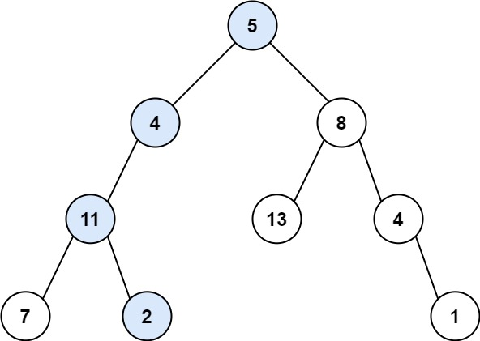

<h1 style="text-align: center;"> <span style="color: #00AF9B;">112. 路径总和</span> </h1>

### 🚀 LeetCode

<base target="_blank">

<span style="color: #00AF9B;">**Easy**</span> [**https://leetcode.cn/problems/path-sum/**](https://leetcode.cn/problems/path-sum/)

---

### ❓ Description

<br/>

给你二叉树的根节点 `root` 和一个表示目标和的整数 `targetSum` 。

判断该树中是否存在 **根节点到叶子节点** 的路径，这条路径上所有节点值相加等于目标和 `targetSum` 。

如果存在，返回 `true` ；否则，返回 `false` 。

**叶子节点** 是指没有子节点的节点。

<br/>

**示例 1：**



```
输入: root = [5, 4, 8, 11, null, 13, 4, 7, 2, null, null, null, 1], targetSum = 22
输出: true
解释: 等于目标和的根节点到叶节点路径如上图所示
```

**示例 2：**


```
输入: root = [1, 2, 3], targetSum = 5
输出: false
解释: 
    * 树中存在两条根节点到叶子节点的路径
    * (1 --> 2): 和为 3
    * (1 --> 3): 和为 4
    * 不存在 sum = 5 的根节点到叶子节点的路径
```

**示例 3：**

```
输入: root = [], targetSum = 0
输出: false
解释: 由于树是空的, 所以不存在根节点到叶子节点的路径
```

<br/>

**提示：**

* 树中节点的数目在范围 `[0, 5000]` 内
* `-1000 <= Node.val <= 1000`
* `-1000 <= targetSum <= 1000`

---

### ❗ Solution

<br/>

#### idea

* 首先判断 **当前节点** 是否为 `null`，如果是则直接返回 `false`

<br/>

* 如果 **当前节点** 不为 `null`，判断 **当前节点** 有没有 **子节点**
* 如果 **左右子节点** 都为 `null`，说明 **当前节点** 是 **叶子节点**
* 判断 **目标值** `targetSum` 减去 **当前节点的值** `root.val` 是否为 `0`

<br/>

* 如果为 `0` 说明从 **根节点** 走到 **当前叶子节点** 的 **路径总和** 刚好等于 `targetSum`，返回 `true`
* 如果不为 `0`，说明 **当前路径** 不符合要求，返回 `false`

<br/>

* 如果 **当前节点** 不是 **叶子节点** ，往 **左右子节点** 分别递归，直到找到 **叶子节点**
* **递归** 时将 **子节点** 和 `targetSum - root.val` 之后的值作为参数传递给下一级

<br/>

* **左右子节点** 的路径，会各自返回 **路径总和** 是否等于 `targetSum` 的判断
* 只要有一个子节点返回 true，当前节点就应该也返回 true
* 最终 **递归** 回到 **根节点**，**只要有一条路径上的叶子节点** 返回了 `true` 的判断，最终结果就是 `true`
* 即可以找到一条 **路径**，**路径总和** == `targetSum`

<br/>

#### Java

```
/**
 * Definition for a binary tree node.
 * public class TreeNode {
 *     int val;
 *     TreeNode left;
 *     TreeNode right;
 *     TreeNode() {}
 *     TreeNode(int val) { this.val = val; }
 *     TreeNode(int val, TreeNode left, TreeNode right) {
 *         this.val = val;
 *         this.left = left;
 *         this.right = right;
 *     }
 * }
 */
class Solution {
    public boolean hasPathSum(TreeNode root, int targetSum) {
        if (root == null) {
            return false;
        }
        if (root.left == null && root.right == null) {
            return targetSum - root.val == 0;
        } else {
            return hasPathSum(root.left, targetSum - root.val) || 
                   hasPathSum(root.right, targetSum - root.val);
        }
    }
}
```

<br/>

#### JavaScript

```
/**
 * Definition for a binary tree node.
 * function TreeNode(val, left, right) {
 *     this.val = (val===undefined ? 0 : val)
 *     this.left = (left===undefined ? null : left)
 *     this.right = (right===undefined ? null : right)
 * }
 */
/**
 * @param {TreeNode} root
 * @param {number} targetSum
 * @return {boolean}
 */
var hasPathSum = function(root, targetSum) {
    if (root == null) {
        return false
    }
    if (root.left == null && root.right == null) {
        return targetSum - root.val == 0
    } else {
        return hasPathSum(root.left, targetSum - root.val) || 
               hasPathSum(root.right, targetSum - root.val)
    }
};
```

<br/>

#### C#

```
/**
 * Definition for a binary tree node.
 * public class TreeNode {
 *     public int val;
 *     public TreeNode left;
 *     public TreeNode right;
 *     public TreeNode(int val=0, TreeNode left=null, TreeNode right=null) {
 *         this.val = val;
 *         this.left = left;
 *         this.right = right;
 *     }
 * }
 */
public class Solution {
    public bool HasPathSum(TreeNode root, int targetSum) {
        if (root == null) {
            return false;
        }
        if (root.left == null && root.right == null) {
            return targetSum - root.val == 0;
        } else {
            return HasPathSum(root.left, targetSum - root.val) || 
                   HasPathSum(root.right, targetSum - root.val);
        }
    }
}
```

<br/>

#### Scala

```
/**
 * Definition for a binary tree node.
 * class TreeNode(_value: Int = 0, _left: TreeNode = null, _right: TreeNode = null) {
 *   var value: Int = _value
 *   var left: TreeNode = _left
 *   var right: TreeNode = _right
 * }
 */
object Solution {
    def hasPathSum(root: TreeNode, targetSum: Int): Boolean = {
        if (root == null) {
            return false;
        }
        if (root.left == null && root.right == null) {
            return targetSum - root.value == 0;
        } else {
            return hasPathSum(root.left, targetSum - root.value) || 
                   hasPathSum(root.right, targetSum - root.value);
        }
    }
}
```

<br/>

#### Go

```
/**
 * Definition for a binary tree node.
 * type TreeNode struct {
 *     Val int
 *     Left *TreeNode
 *     Right *TreeNode
 * }
 */
func hasPathSum(root *TreeNode, targetSum int) bool {
    if root == nil {
        return false;
    }
    if root.Left == nil && root.Right == nil {
        return targetSum - root.Val == 0;
    } else {
        return hasPathSum(root.Left, targetSum - root.Val) || 
               hasPathSum(root.Right, targetSum - root.Val);
    }
}
```

<br/>

#### TypeScript

```
/**
 * Definition for a binary tree node.
 * class TreeNode {
 *     val: number
 *     left: TreeNode | null
 *     right: TreeNode | null
 *     constructor(val?: number, left?: TreeNode | null, right?: TreeNode | null) {
 *         this.val = (val===undefined ? 0 : val)
 *         this.left = (left===undefined ? null : left)
 *         this.right = (right===undefined ? null : right)
 *     }
 * }
 */
function hasPathSum(root: TreeNode | null, targetSum: number): boolean {
    if (root == null) {
            return false
    }
    if (root.left == null && root.right == null) {
        return targetSum - root.val == 0
    } else {
        return hasPathSum(root.left, targetSum - root.val) || 
               hasPathSum(root.right, targetSum - root.val)
    }
};
```

<br/>

#### Kotlin

```
/**
 * Example:
 * var ti = TreeNode(5)
 * var v = ti.`val`
 * Definition for a binary tree node.
 * class TreeNode(var `val`: Int) {
 *     var left: TreeNode? = null
 *     var right: TreeNode? = null
 * }
 */
class Solution {
    fun hasPathSum(root: TreeNode?, targetSum: Int): Boolean {
        if (root == null) {
            return false;
        }
        if (root.left == null && root.right == null) {
            return targetSum - root.`val` == 0;
        } else {
            return hasPathSum(root.left, targetSum - root.`val`) || 
                   hasPathSum(root.right, targetSum - root.`val`);
        }
    }
}
```
