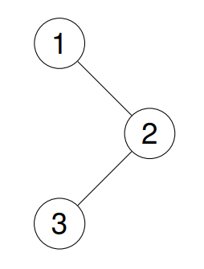

<h1 style="text-align: center;"> <span style="color: #00AF9B;">144. 二叉树的前序遍历</span> </h1>

### 🚀 LeetCode

<base target="_blank">

<span style="color: #00AF9B;">**Easy**</span> [**https://leetcode.cn/problems/binary-tree-preorder-traversal/**](https://leetcode.cn/problems/binary-tree-preorder-traversal/)

---

### ❓ Description

<br/>

给你二叉树的根节点 `root`，返回它节点值的 **前序遍历**。

<br/>

**示例 1：**



```
输入: root = [1, null, 2, 3]
输出: [1, 2, 3]
```

**示例 2：**


```
输入: root = [1, 2, 3, 4, 5, null, 8, null, null, 6, 7, 9]
输出: [1, 2, 4, 5, 6, 7, 3, 8, 9]
```

**示例 3：**

```
输入: root = []
输出: []
```

**示例 4：**

```
输入: root = [1]
输出: [1]
```

<br/>

**提示：**

* 树中节点数目在范围 `[0, 100]` 内
* `-100 <= Node.val <= 100`

<br/>

**进阶：** 递归算法很简单，你可以通过迭代算法完成吗？

---

### ❗ Solution

<br/>

#### idea

* **前序遍历**：按 **中左右** 的顺序遍历二叉树
* 先添加 **当前节点**，再递归遍历 **左子树**，最后递归遍历 **右子树**

<br/>

#### Java

```
/**
 * Definition for a binary tree node.
 * public class TreeNode {
 * int val;
 * TreeNode left;
 * TreeNode right;
 * TreeNode() {}
 * TreeNode(int val) { this.val = val; }
 * TreeNode(int val, TreeNode left, TreeNode right) {
 * this.val = val;
 * this.left = left;
 * this.right = right;
 * }
 * }
 */
class Solution {
    public List<Integer> preorderTraversal(TreeNode root) {
        List<Integer> res = new ArrayList<Integer>();
        preorder(root, res);
        return res;
    }

    public void preorder(TreeNode root, List<Integer> res) {
        if (root == null) {
            return;
        }
        res.add(root.val);
        preorder(root.left, res);
        preorder(root.right, res);
    }
}
```
