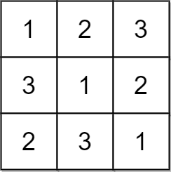
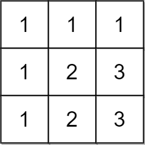

<h1 style="text-align: center;"> <span style="color: #00AF9B;">2133. 检查是否每一行每一列都包含全部整数</span> </h1>

### 🚀 LeetCode

<base target="_blank">

<span style="color: #00AF9B;">**Easy**</span> [**https://leetcode.cn/problems/check-if-every-row-and-column-contains-all-numbers/**](https://leetcode.cn/problems/check-if-every-row-and-column-contains-all-numbers/)

---

### ❓ Description

<br/>

对一个大小为 `n x n` 的矩阵而言，如果其每一行和每一列都包含从 `1` 到 `n` 的 **全部** 整数（含 `1` 和 `n`），则认为该矩阵是一个 **有效** 矩阵。

给你一个大小为 `n x n` 的整数矩阵 `matrix` ，请你判断矩阵是否为一个有效矩阵：如果是，返回 `true` ；否则，返回 `false` 。

<br/>

**示例 1：**



```
输入: matrix = [[1, 2, 3], [3, 1, 2], [2, 3, 1]]
输出: true
解释: 在此例中 n = 3, 每一行和每一列都包含数字 1、2、3, 因此返回 true
```

**示例 2：**



```
输入: matrix = [[1, 1, 1], [1, 2, 3], [1, 2, 3]]
输出: false
解释: 在此例中 n = 3, 但第一行和第一列不包含数字 2 和 3, 因此返回 false
```

<br/>

**提示：**

* `n == matrix.length == matrix[i].length`
* `1 <= n <= 100`
* `1 <= matrix[i][j] <= n`

---

### ❗ Solution

<br/>

#### idea

* 利用 `Set` **元素唯一** 的特点
* 如果某一行或某一列有重复元素，最终 `Set` 的长度就会小于矩阵的长度

<br/>

* 时间复杂度：O(n<sup>2</sup>)
* 空间复杂度：O(n)

<br/>

#### Java

```
class Solution {
    public boolean checkValid(int[][] matrix) {
        int len = matrix.length;
        Set<Integer> row = new HashSet<Integer>(len);
        Set<Integer> col = new HashSet<Integer>(len);
        for(int i = 0; i < len; i++) {
            for(int j = 0; j < len; j++) {
                row.add(matrix[i][j]);
                col.add(matrix[j][i]);
            }
            if(row.size() != len || col.size()!= len) {
                return false;
            }
            row.clear();
            col.clear();
        }
        return true;
    }
}
```
