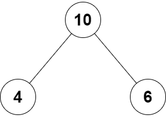
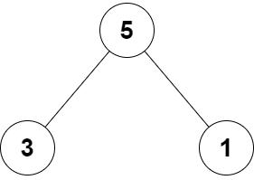

<h1 style="text-align: center;"> <span style="color: #00AF9B;">2236. 判断根结点是否等于子结点之和</span> </h1>

### 🚀 LeetCode

<base target="_blank">

<span style="color: #00AF9B;">**Easy**</span> [**https://leetcode.cn/problems/root-equals-sum-of-children/**](https://leetcode.cn/problems/root-equals-sum-of-children/)

---

### ❓ 题目描述

<br/>

给你一个 **二叉树** 的根结点 `root`，该二叉树由恰好 `3` 个结点组成：根结点、左子结点和右子结点。

如果根结点值等于两个子结点值之和，返回 `true` ，否则返回 `false` 。

<br/>

**示例 1：**



```
输入: root = [10, 4, 6]
输出: true
解释: 
    * 根结点、左子结点和右子结点的值分别是 10 、4 和 6
    * 由于 10 等于 4 + 6, 因此返回 true
```

**示例 2：**



```
输入: root = [5, 3, 1]
输出: false
解释: 
    * 根结点、左子结点和右子结点的值分别是 5 、3 和 1
    * 由于 5 不等于 3 + 1, 因此返回 false
```

<br/>

**提示：**

* 树只包含根结点、左子结点和右子结点
* `-100 <= Node.val <= 100`

---

### ❗ 题解

<br/>

🅰 ➖ ➖ ➖ ➖ ➖ 🅱 ❓

<br/>

#### Java

```
/**
 * Definition for a binary tree node.
 * public class TreeNode {
 *     int val;
 *     TreeNode left;
 *     TreeNode right;
 *     TreeNode() {}
 *     TreeNode(int val) { this.val = val; }
 *     TreeNode(int val, TreeNode left, TreeNode right) {
 *         this.val = val;
 *         this.left = left;
 *         this.right = right;
 *     }
 * }
 */
class Solution {
    public boolean checkTree(TreeNode root) {
        return root.val == root.left.val + root.right.val;
    }
}
```

<br/>

#### Rust

```
// Definition for a binary tree node.
// #[derive(Debug, PartialEq, Eq)]
// pub struct TreeNode {
//   pub val: i32,
//   pub left: Option<Rc<RefCell<TreeNode>>>,
//   pub right: Option<Rc<RefCell<TreeNode>>>,
// }
//
// impl TreeNode {
//   #[inline]
//   pub fn new(val: i32) -> Self {
//     TreeNode {
//       val,
//       left: None,
//       right: None
//     }
//   }
// }
use std::rc::Rc;
use std::cell::RefCell;
impl Solution {
    pub fn check_tree(root: Option<Rc<RefCell<TreeNode>>>) -> bool {
        return 
            root.as_ref().unwrap().borrow().val == 
            root.as_ref().unwrap().borrow().left.as_ref().unwrap().borrow().val + 
            root.as_ref().unwrap().borrow().right.as_ref().unwrap().borrow().val;
    }
}
```
