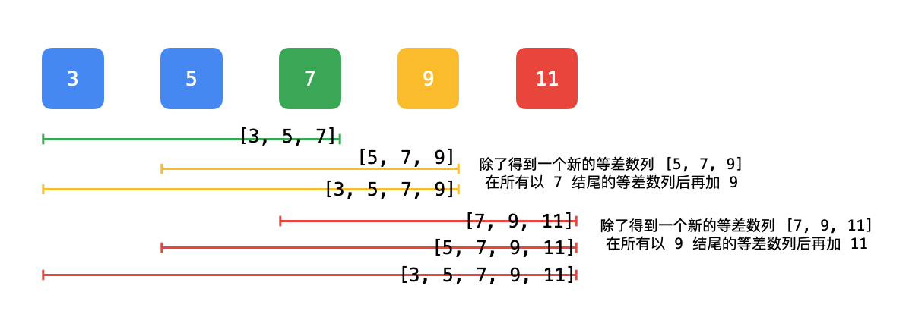

<h1 style="text-align: center;"> <span style="color: #FF2D55;">446. 等差数列划分 II - 子序列</span> </h1>

### 🚀 LeetCode

<base target="_blank">

<span style="color: #FF2D55;">**Hard**</span> [**https://leetcode.cn/problems/arithmetic-slices-ii-subsequence/**](https://leetcode.cn/problems/arithmetic-slices-ii-subsequence/)

---

### ❓ Description

<br/>

给你一个整数数组 `nums`，返回 `nums` 中所有 **等差子序列** 的数目。

如果一个序列中 **至少有三个元素**，并且任意两个相邻元素之差相同，则称该序列为等差序列。

* 例如，`[1, 3, 5, 7, 9]`、`[7, 7, 7, 7]` 和 `[3, -1, -5, -9]` 都是等差序列。
* 再例如，`[1, 1, 2, 5, 7]` 不是等差序列。

数组中的子序列是从数组中删除一些元素（也可能不删除）得到的一个序列。

* 例如，`[2, 5, 10]` 是 `[1, 2, 1, 2, 4, 1, 5, 10]` 的一个子序列。

题目数据保证答案是一个 `32-bit` 整数。

<br/>

**示例 1：**

```
输入: nums = [2, 4, 6, 8, 10]
输出: 7
解释: 所有的等差子序列为: 
[2, 4, 6]
[4, 6, 8]
[6, 8, 10]
[2, 4, 6, 8]
[4, 6, 8, 10]
[2, 4, 6, 8, 10]
[2, 6, 10]
```

**示例 2：**

```
输入: nums = [7, 7, 7, 7, 7]
输出: 16
解释: 数组中的任意子序列都是等差子序列
```

<br/>

**提示：**

* `1  <= nums.length <= 1000`
* `-2^31 <= nums[i] <= 2^31 - 1`

---

### ❗ Solution

<br/>

#### idea

* 如果数组长度小于 `3`，不存在等差数列，直接返回 `0`

<br/>

* 新建一个变量 `count`，记录等差数列的数量

<br/>

* 新建一个 `List<Map<Long, Integer>>` 类型的变量 `list`
* 记录 **下标** ：**该下标的数作为结尾的各种等差** ：**该等差对应的等差数列的数量** 三者的对应关系
    * 使用 `Long` 类型接收等差
    * 是因为 `Integer.MIN_VALUE < nums[i] < Integer.MAX_VALUE`
    * 两个数的差值可能会超过 `Integer` 的范围

<br/>

* 使用 <span style="color: #AF52DE;">**左右指针**</span> 遍历数组 `nums`
* 计算 `nums[right] - nums[left]` 的差值 `d`

<br/>

```
long d = nums[right] - nums[left] * 1L;
int c = list.get(left).getOrDefault(d, 0);
```

* 根据 `left`，获取结尾下标为 `left` 的各种等差
* 再根据当前差值 `d`，获取结尾下标为 `left`，等差为 `d` 的 **等差数列** 的数量 `c`
* 如果结尾下标为 `left`，等差为 `d` 的情况第一次出现，获取默认值 `0`
* 表示 **当前子数组** 只有两个数，还未构成 **等差数列**，所以数量 `+ 0`

<br/>

```
count += c;
```

* 将当前的 `nums[right]`，添加到所有结尾下标为 `left`，等差为 `d` 的 **等差数列** 的结尾
* 可以获得与对应的数量 `c` 相等的 **新的等差队列**
* 所以当 `count += c` 之后
* `c` 也同时代表了：结尾下标为 `right`，等差为 `d`，且结尾前一个下标为 `left` 的 **等差数列** 的数量



<br/>

```
list.get(right).put(d, list.get(right).getOrDefault(d, 0) + c + 1);
```

* 再设置下标为 `right`，等差为 `d` 的 **等差数列** 的数量
* 数量 `=` 结尾下标为 `right`，等差为 `d`，但结尾前一个下标不为 `left` 的 **等差数列** 的数量 `list.get(right).getOrDefault(d, 0)`
    * 例如：`[2, 4, 4, 6]` 这个数组
    * `6` 可以跟在下标为 `1` 的 `4` 后面
    * 也可以跟在下标为 `2` 的 `4` 后面
* `+` 结尾下标为 `right`，等差为 `d`，且结尾前一个下标为 `left` 的 **等差数列** 的数量 `c`
* 再 `+ 1`
    * 因为 `[nums[left], nums[right]]` 可以作为一个 **弱等差数列**
    * 当再有一个数符合该 **等差条件** 时，即下一个数 `num` 添加到 `[nums[left], nums[right]]` 的后面时
    * `[nums[left], nums[right], num]` 就可以构成一个 **新的等差数列**

<br/>

#### Java

```
class Solution {
    public int numberOfArithmeticSlices(int[] nums) {
        int length = nums.length;
        if (length < 3) {
            return 0;
        }

        int count = 0;

        List<Map<Long, Integer>> list = new ArrayList<>();
        for (int i = 0; i < length; i++) {
            list.add(new HashMap<>());
        }

        for (int right = 1; right < length; right++) {
            for (int left = 0; left < right; left++) {
                long d = nums[right] - nums[left] * 1L;
                int c = list.get(left).getOrDefault(d, 0);
                count += c;
                list.get(right).put(d, list.get(right).getOrDefault(d, 0) + c + 1);
            }
        }

        return count;
    }
}
```
