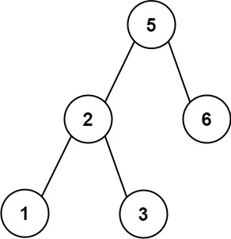

<h1 style="text-align: center;"> <span style="color: #FFB822;">255. 验证二叉搜索树的前序遍历序列</span> </h1>

### 🚀 LeetCode

<base target="_blank">

<span style="color: #FFB822;">**Medium**</span> [**https://leetcode.cn/problems/verify-preorder-sequence-in-binary-search-tree/**](https://leetcode.cn/problems/verify-preorder-sequence-in-binary-search-tree/)

---

### ❓ Description

<br/>

给定一个 **无重复元素** 的整数数组 `preorder`，*如果它是以二叉搜索树的**先序遍历**排列*，返回 `true`。

<br/>

**示例 1：**



```
输入: preorder = [5, 2, 1, 3, 6]
输出: true
```

**示例 2：**

```
输入: preorder = [5, 2, 6, 1, 3]
输出: false
```

<br/>

**提示：**

* `1 <= preorder.length <= 104`
* `1 <= preorder[i] <= 104`
* `preorder` 中 **无重复元素**

<br/>

**进阶：** 您能否使用恒定的空间复杂度来完成此题？

---

### ❗ Solution

<br/>

#### idea

* **前序遍历**的顺序为：**根节点 -> 左子树 -> 右子树**
* 所以数组的第一个元素为**根节点**
* 除第一个元素外，数组的前半部分为**左子树**，后半部分为**右子树**
* 每一个子树对应的子数组，也会符合上述的规则

<br/>

#### Java

```
class Solution {
    public boolean verifyPreorder(int[] preorder) {
        return verify(preorder, 0, preorder.length - 1);
    }

    public boolean verify(int[] preorder, int root, int child) {
        if (child <= root) {
            return true;
        }

        int right = child;
        while (preorder[right] > preorder[root]) {
            right--;
        }

        int left = right;
        while (preorder[left] < preorder[root]) {
            left--;
        }

        return left == root &&
               verify(preorder, left + 1, right) &&
               verify(preorder, right + 1, child);
    }
}
```
