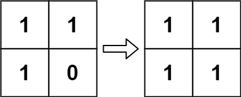

<h1 style="text-align: center;"> <span style="color: #FFB822;">289. 生命游戏</span> </h1>

### 🚀 LeetCode

<base target="_blank">

<span style="color: #FFB822;">**Medium**</span> [**https://leetcode.cn/problems/game-of-life/**](https://leetcode.cn/problems/game-of-life/)

---

### ❓ Description

<br/>

[**生命游戏**](https://baike.baidu.com/item/%E5%BA%B7%E5%A8%81%E7%94%9F%E5%91%BD%E6%B8%B8%E6%88%8F/22668799) ，简称为 **生命** ，是英国数学家 **约翰 · 何顿 · 康威** 在 `1970` 年发明的细胞自动机。

给定一个包含 `m × n` 个格子的面板，每一个格子都可以看成是一个细胞。

每个细胞都具有一个初始状态： `1` 即为 **活细胞（live）** ，或 `0` 即为 **死细胞（dead）** 。

每个细胞与其八个相邻位置（水平，垂直，对角线）的细胞都遵循以下四条生存定律：

1. 如果活细胞周围八个位置的活细胞数少于两个，则该位置活细胞死亡；
2. 如果活细胞周围八个位置有两个或三个活细胞，则该位置活细胞仍然存活；
3. 如果活细胞周围八个位置有超过三个活细胞，则该位置活细胞死亡；
4. 如果死细胞周围正好有三个活细胞，则该位置死细胞复活；

下一个状态是通过将上述规则同时应用于当前状态下的每个细胞所形成的，其中细胞的出生和死亡是同时发生的。

给你 `m x n` 网格面板 `board` 的当前状态，返回下一个状态。

<br/>

**示例 1：**


```
输入: board = [[0, 1, 0], [0, 0, 1], [1, 1, 1], [0, 0, 0]]
输出: [[0, 0, 0], [1, 0, 1], [0, 1, 1], [0, 1, 0]]
```

**示例 2：**



```
输入: board = [[1, 1], [1, 0]]
输出: [[1, 1], [1, 1]]
```

<br/>

**提示：**

* `m == board.length`
* `n == board[i].length`
* `1 <= m, n <= 25`
* `board[i][j]` 为 `0` 或 `1`

<br/>

**进阶：**

* 你可以使用 [**原地**](https://baike.baidu.com/item/%E5%8E%9F%E5%9C%B0%E7%AE%97%E6%B3%95) 算法解决本题吗？
* 请注意，面板上所有格子需要同时被更新：你不能先更新某些格子，然后使用它们的更新后的值再更新其他格子。
* 本题中，我们使用二维数组来表示面板。
* 原则上，面板是无限的，但当活细胞侵占了面板边界时会造成问题。
* 你将如何解决这些问题？

---

### ❗ Backup Solution

<br/>

#### idea

* 拷贝 `board` 到一个新的二维数组 `backupBoard` 中做备份（这样无法满足进阶中 **原地** 的要求）
* 遍历 `backupBoard`
* 统计每一个 `cell` 周围存活的细胞数量
* 统计完后判断当前 `cell` 的状态，修改 `board` 数组

<br/>

#### Java

```
class Solution {
    public void gameOfLife(int[][] board) {
        int row = board.length;
        int col = board[0].length;
        int[][] backupBoard = new int[row][col];
        for (int i = 0; i < row; i++) {
            for (int j = 0; j < col; j++) {
                backupBoard[i][j] = board[i][j];
            }
        }
        for (int i = 0; i < row; i++) {
            for (int j = 0; j < col; j++) {
                int liveCell = 0;
                for (int x = i - 1; x <= i + 1; x++) {
                    for (int y = j - 1; y <= j + 1; y++) {
                        if (
                            x >= 0 && x < row && y >= 0 && y < col && 
                            !(x == i && y == j) && backupBoard[x][y] == 1
                        ) {
                            liveCell++;
                        }
                    }
                }
                if (liveCell < 2 || liveCell > 3) {
                    board[i][j] = 0;
                } else if (liveCell == 3) {
                    board[i][j] = 1;
                }
            }
        }
    }
}
```
