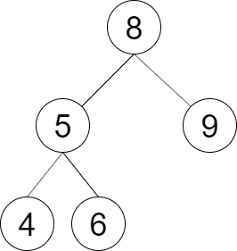

<h1 style="text-align: center;"> <span style="color: #FFB822;">LCR 152. 验证二叉搜索树的后序遍历序列</span> </h1>

### 🚀 LeetCode

<base target="_blank">

<span style="color: #FFB822;">**Medium**</span> [**https://leetcode.cn/problems/er-cha-sou-suo-shu-de-hou-xu-bian-li-xu-lie-lcof/**](https://leetcode.cn/problems/er-cha-sou-suo-shu-de-hou-xu-bian-li-xu-lie-lcof/)

---

### ❓ Description

<br/>

请实现一个函数来判断整数数组 `postorder` 是否为二叉搜索树的后序遍历结果。

<br/>

**示例 1：**


```
输入: postorder = [4, 9, 6, 5, 8]
输出: false
解释: 从上图可以看出这不是一颗二叉搜索树
```

**示例 2：**



```
输入: postorder = [4, 6, 5, 9, 8]
输出: true
解释: 可构建的二叉搜索树如上图
```

<br/>

**提示：**

* 数组长度 `<= 1000`
* `postorder` 中无重复数字

---

### ❗ Solution

<br/>

#### idea

* **后序遍历**的顺序为：**左子树 -> 右子树 -> 根节点**
* 所以数组的最后一个元素为**根节点**
* 除最后一个元素外，数组的前半部分为**左子树**，后半部分为**右子树**
* 每一个子树对应的子数组，也会符合上述的规则

<br/>

#### Java

```
class Solution {
    public boolean verifyTreeOrder(int[] postorder) {
        return verify(postorder, 0, postorder.length - 1);
    }

    public boolean verify(int[] postorder, int child, int root) {
        if (child >= root) {
            return true;
        }

        // 遍历左子树
        int left = child;
        while (postorder[left] < postorder[root]) {
            left++;
        }

        // 遍历右子树
        int right = left;
        while (postorder[right] > postorder[root]) {
            right++;
        }

        // 如果是数组一颗二叉搜索树的后续遍历
        // 遍历完左子树的数组元素, 再遍历完右子树的数组元素, 最终 right 指针一定会和 root 节点重合
        return right == root && 
               verify(postorder, child, left - 1) && 
               verify(postorder, left, right - 1);
    }
}
```
